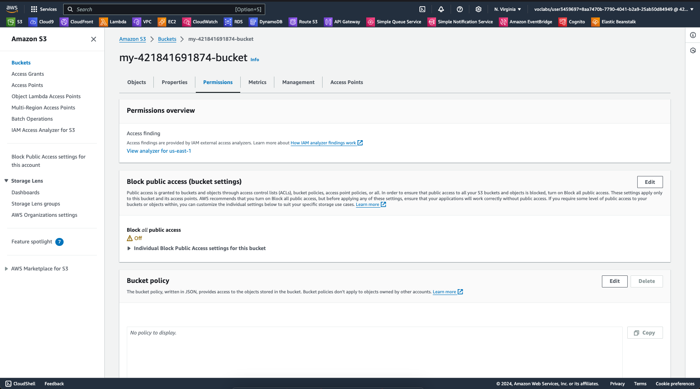

1. Provision S3 bucket:
    > cd ./terraform
    
    > terraform init
    
    > terraform apply 
    
    

2. Upload folder "udacity-starter-website" to bucket:
    > chmod 777 ./upload-folder.sh

    > ./upload-folder.sh

    

3. Update S3 bucket permission:
    - Create and edit permission:
        > cd ./terraform

        > touch s3-policy.tf
    - Apply:
        > terraform apply

    
