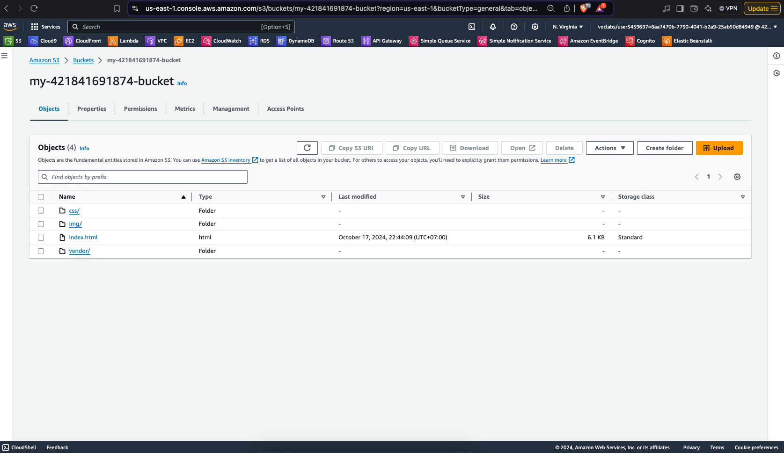
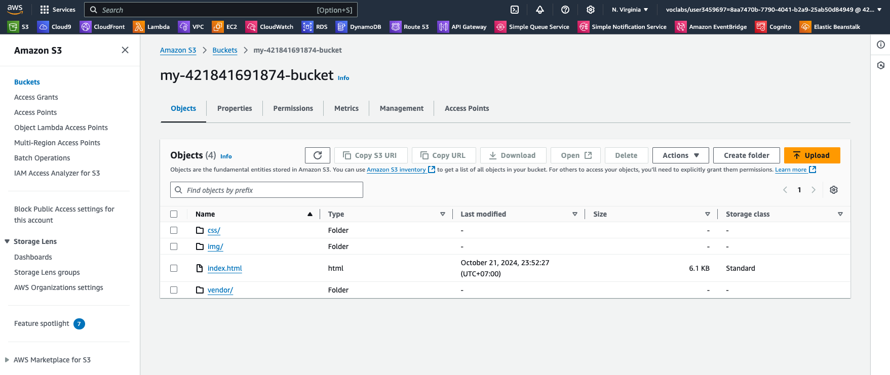
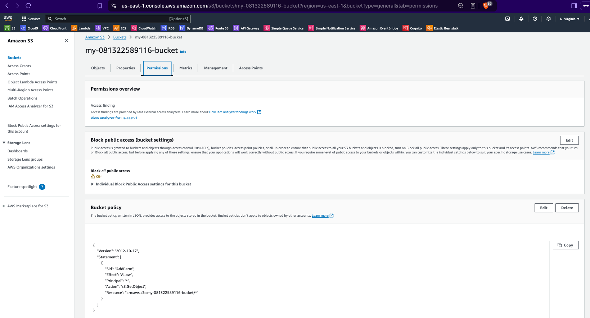
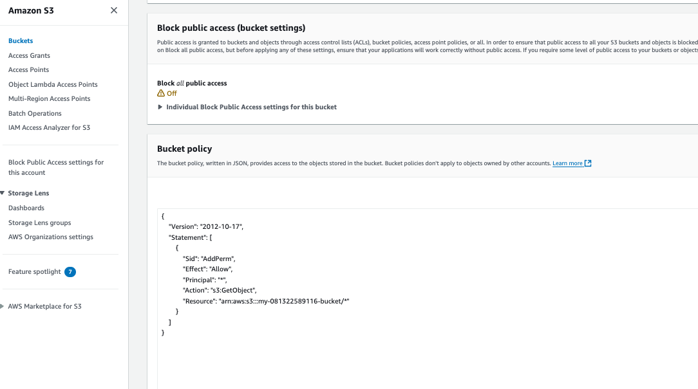
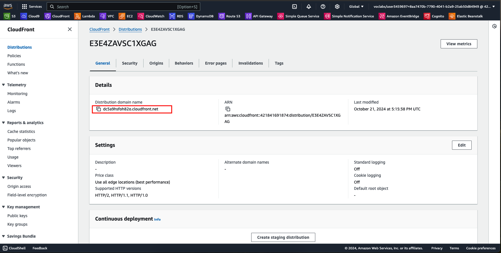

1. Provision S3 bucket:
    > cd ./terraform
    
    > terraform init
    
    > terraform apply 
    
    

2. Upload folder "udacity-starter-website" to bucket:
    > chmod 777 ./upload-folder.sh

    > ./upload-folder.sh

    
3. S3 bucket permission:
    

4. Access through Web static:
    
    

5. Cloudfront distribution:
    
    