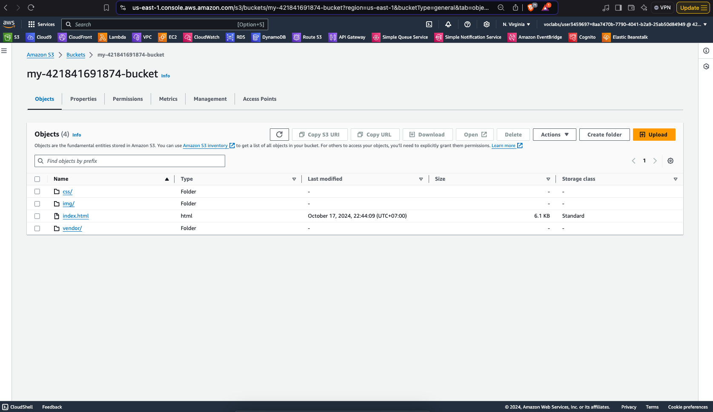
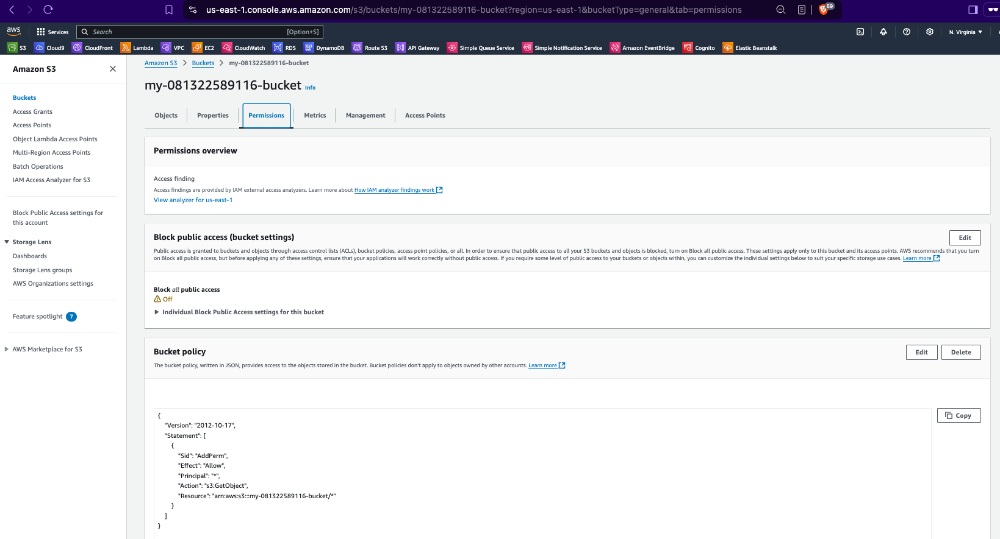
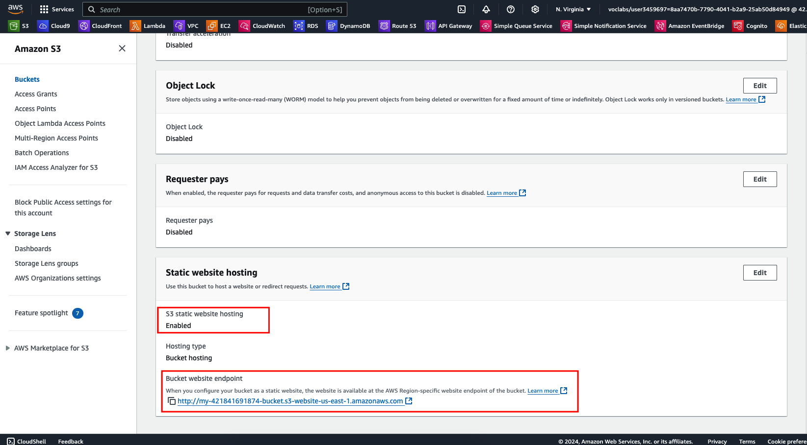
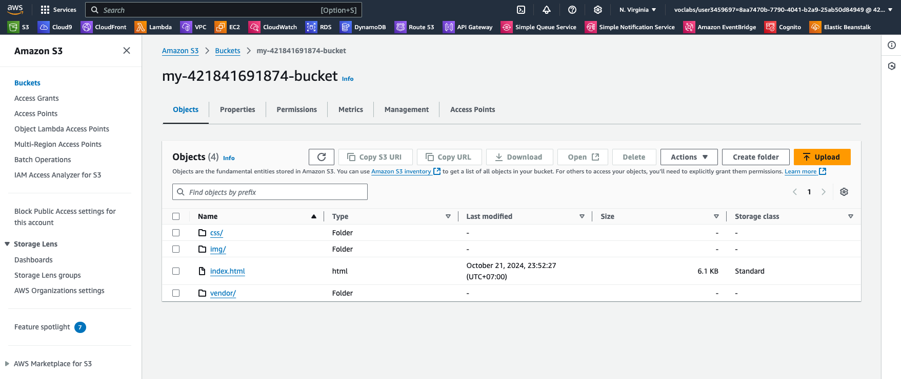
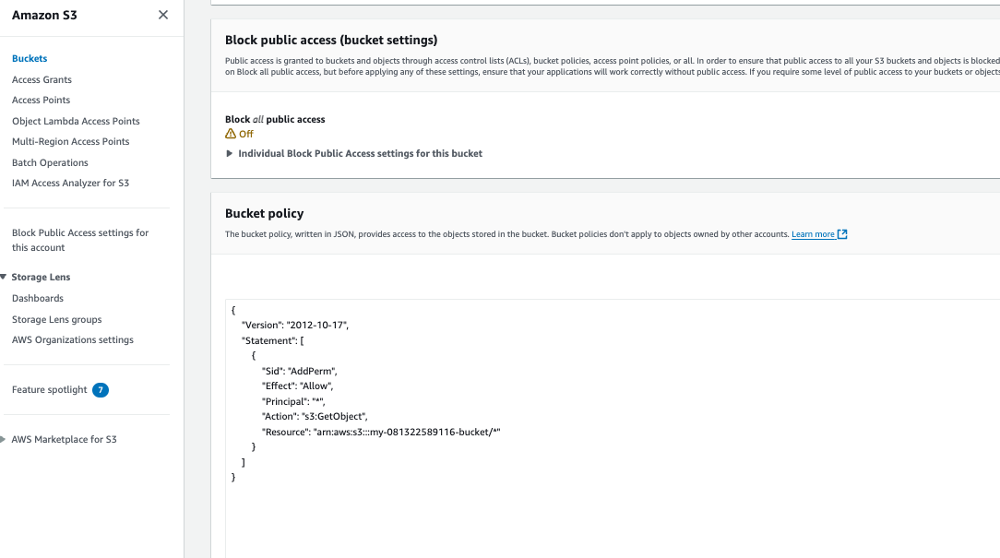
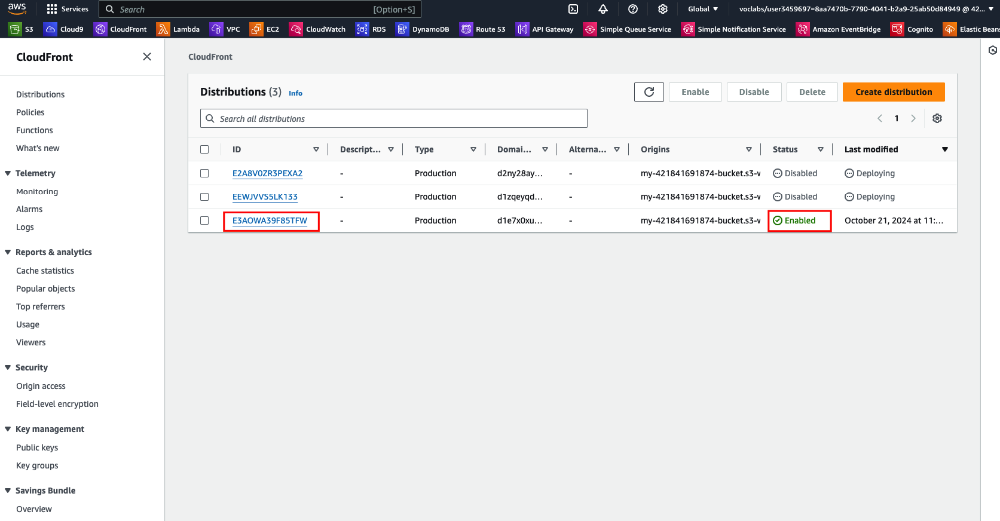
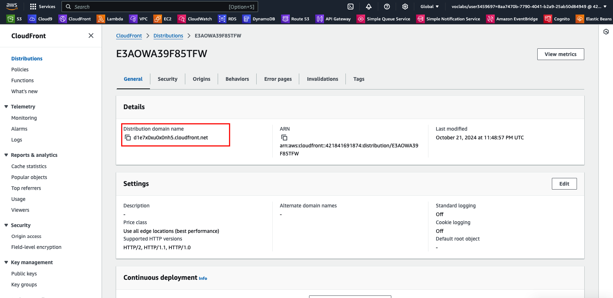
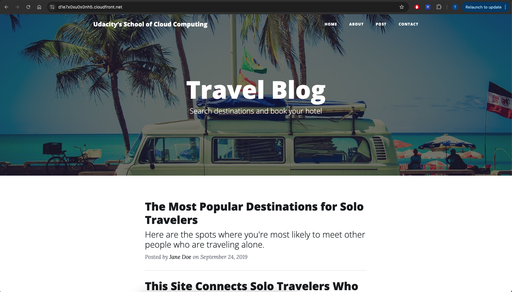

# Installation

1. Provision S3 bucket:
    ```
    cd ./terraform
    terraform init
    terraform apply --auto-approve
    ```
    

2. Upload folder "udacity-starter-website" to bucket:
    ```
    chmod 777 ./upload-folder.sh
    ./upload-folder.sh
    ```


# Usage
## 1. S3 bucket permission
    
    
    

## 2. Objects on bucket:
    

## 3. Static Website Hosting:
- Link: "http://my-421841691874-bucket.s3-website-us-east-1.amazonaws.com"
    
    

## 4. CloudFront distribution 
- State: "Enable"
    
    
- Link: "https://d1e7x0xu0x0nh5.cloudfront.net"
    

# Roadmap
- [x] S3 bucket:
    - [x] S3 policy
    - [x] Upload files/folder
    - [x] Static website hosting
- [x] CloudFront:
    - [x] CloudFront distribution