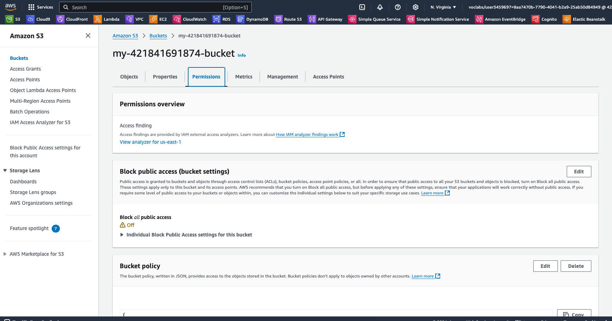

1. Provision S3 bucket:
    > cd ./terraform
    > terraform init
    > terraform apply --auto-approve
    
2. Upload folder "udacity-starter-website" to bucket:
    > chmod 777 ./upload-folder.sh
    > ./upload-folder.sh
    
